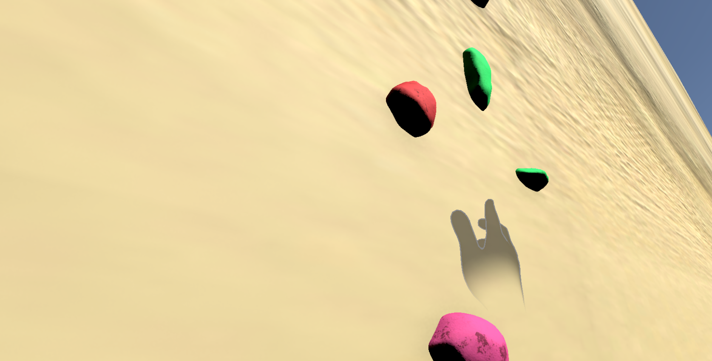
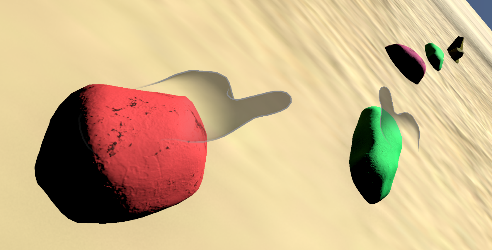
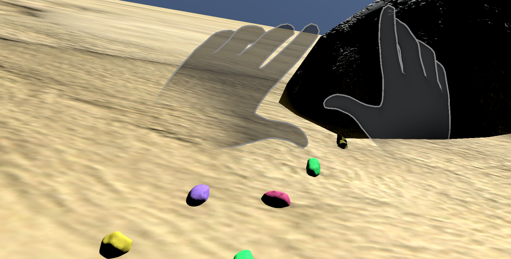
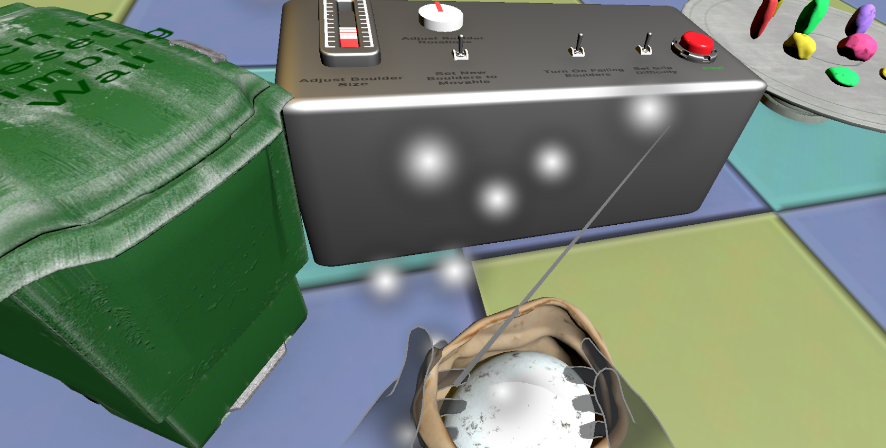
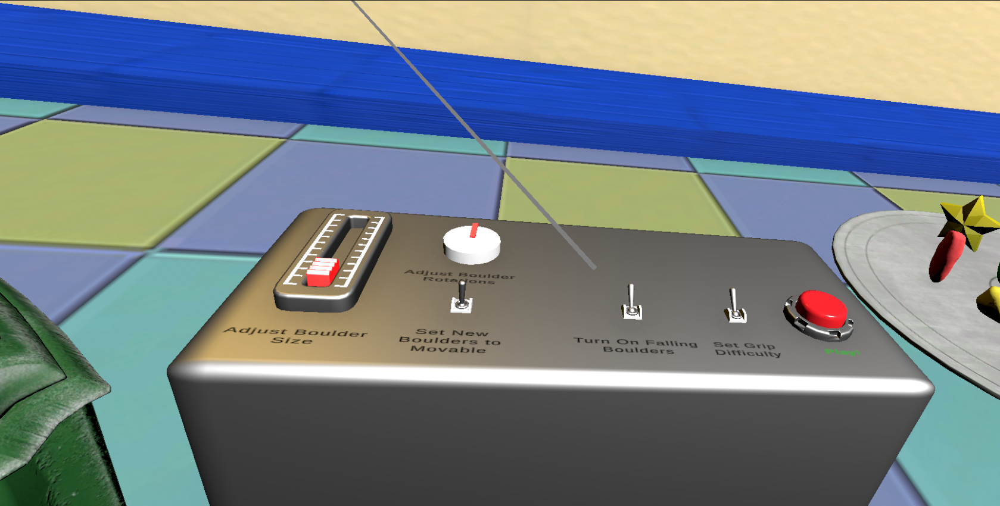
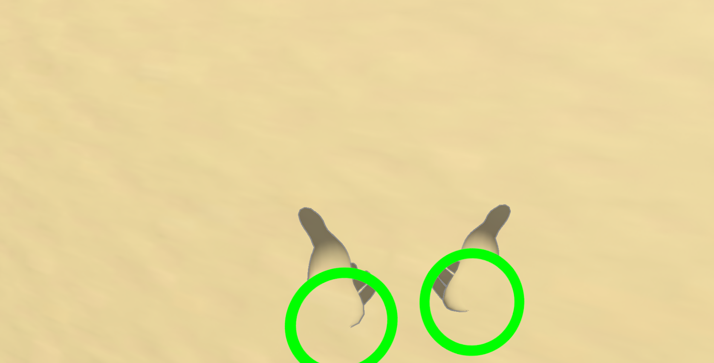
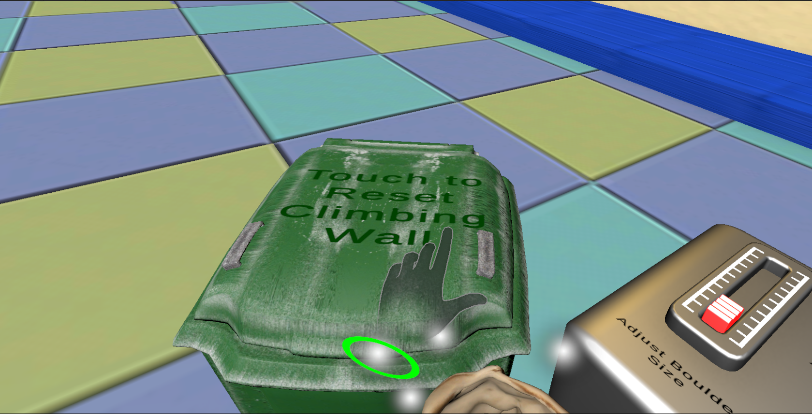
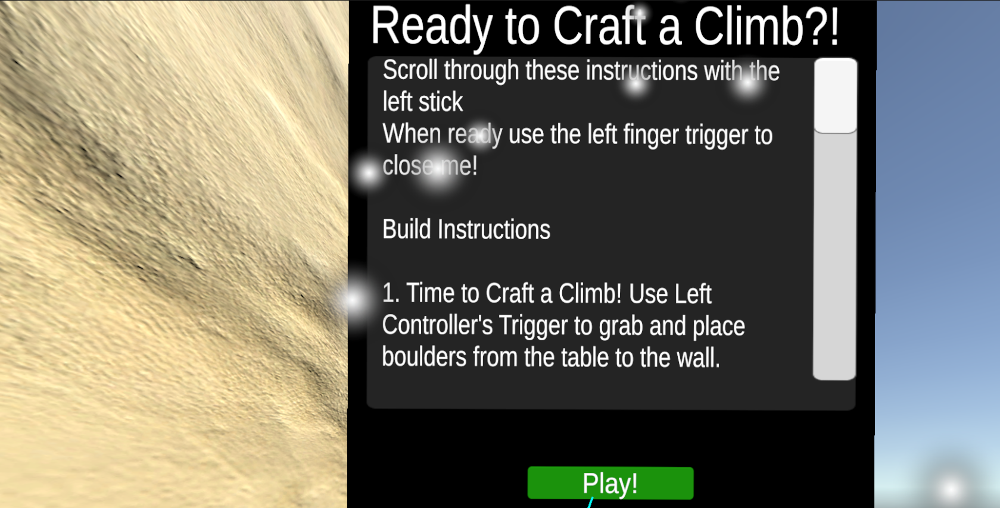

# 🧗 Craft A Climb

Toronto Metropolitan University - Department of Computer Science - CPS643 (Virtual Reality)

## 📌 Project Overview

**Craft A Climb!** is a virtual reality rock climbing experience designed to simulate a real-life bouldering gym. The project combines a **creative wall-building system** with a **sports simulation**, allowing users to design and climb their own routes.

### 👥 Authors

* **Harman Suri**
* **Abishanan Sriranjan**

---

## 📸 Project Snapshot

*Craft A Climb! – The ultimate wall crafting and bouldering experience.*

---

## 📝 Project Description

The goal of this project is to create a rock climbing game that simulates a real-life bouldering gym. The project is approached in two main ways:

1. **Climbing Wall Builder**

   * Players can select their own climbing holds.
   * Users can design and customize unique climbing routes.

2. **Climbing Simulation**

   * **Realistic Mode:** Includes features such as fatigue and grip strength to mimic real-world climbing.
   * **Gamified Mode:** Offers adjustable elements like movable holds and customizable boulder properties (scale and rotation).

Inspired by similar VR experiences such as *The Climb*, this project integrates a **fitness activity** with an immersive **virtual environment (VE)**. Overall, the aim is to blend a **creative builder game** with a **sports simulation**.

---

## 🎥 Project Video: Google Drive Link

Watch the demo online:
🔗 [https://drive.google.com/file/d/1TOa-ZGmRWj3WOWgi5fQEeC8XcTlFA3WK/view?usp=sharing](https://drive.google.com/file/d/1TOa-ZGmRWj3WOWgi5fQEeC8XcTlFA3WK/view?usp=sharing)

---

## 🖼️ Additional Media

| Screenshot                                | Description              |
| ----------------------------------------- | ------------------------ |
|   | Additional climbing view |
|  | Boulder customization    |
|      | Chalk interaction        |
|  | Default environment      |
|  | Stamina system           |
|  | Hold removal feature     |
|            | User interface           |

---

## 🔗 Additional Information

* **GitHub Repository:**
  [https://github.com/AbishananSriran/CraftAClimb/](https://github.com/AbishananSriran/CraftAClimb/)
